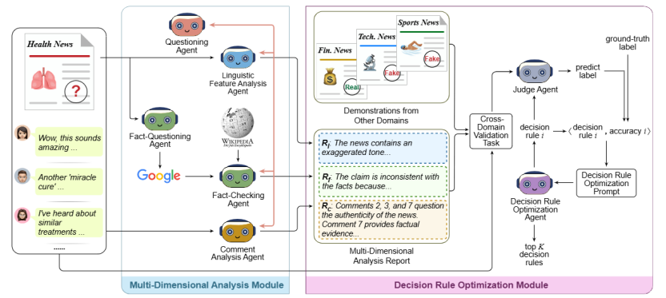
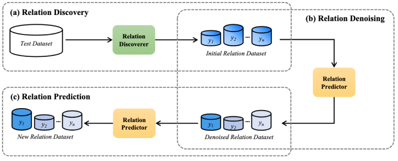
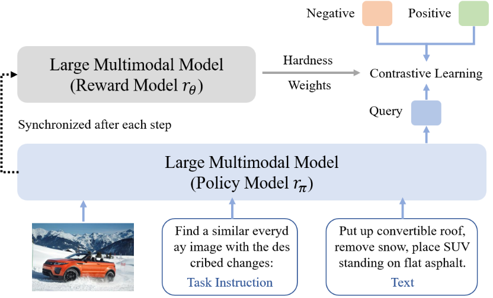
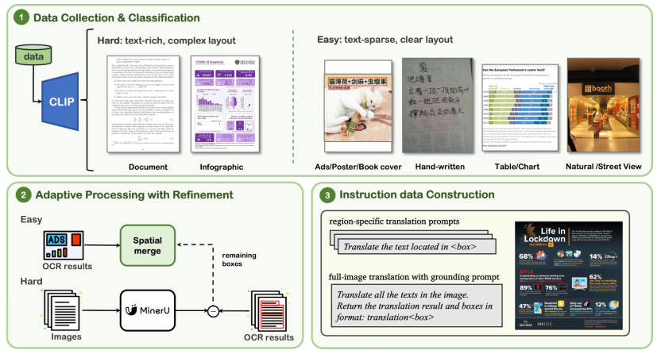
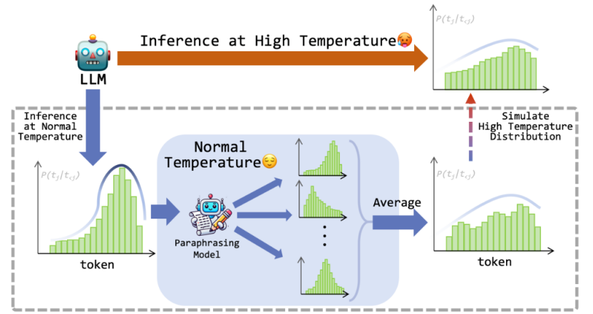
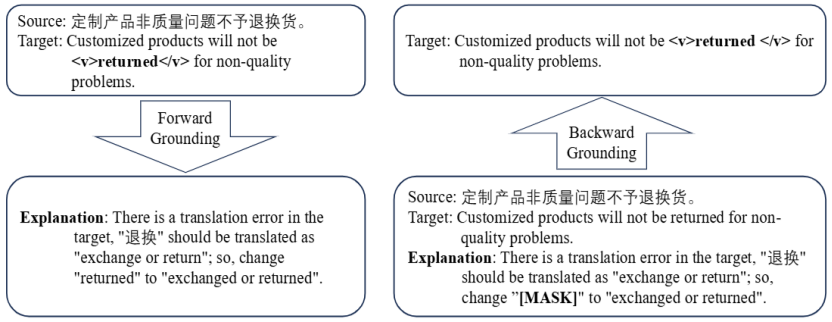

&emsp;&emsp;EMNLP会议全称为Conference on Empirical Methods in Natural Language Processing，是自然语言处理领域的国际顶级学术会议。‌EMNLP 2025 将于2025年11月5日至11月9日在中国苏州举行。
<!--more-->
- - -
- 论文标题：A Multi-Agent Framework with Automated Decision Rule Optimization for Cross-Domain Misinformation Detection
- 录用类型：Main, Long paper
- 论文作者：Hui Li+, Ante Wang+, Kunquan Li, Zhihao Wang, Liang Zhang, Delai Qiu,Qingsong Liu, and Jinsong Su*
- 完成单位：厦门大学，云知声

- 论文简介：当前跨领域虚假信息检测方法都依赖人工设计的决策规则，受限于专家经验，难以在新领域中保持有效性。为此，本文提出了一个多智能体跨领域虚假信息检测框架，结合自动的决策规则优化方法来提升跨领域的检测能力。具体而言，该框架包括两个核心模块：多维度分析模块与决策规则优化模块。在多维度分析模块中，系统引入语言特征分析、评论分析、事实核查等多个专家智能体，并通过质疑-反思机制促进智能体生成更高质量的分析报告，从而全面理解新闻内容。在决策规则优化模块中，模型基于跨领域验证任务迭代优化决策规则，逐步提升决策规则的泛化性和鲁棒性。最后，在两个常用跨领域虚假信息检测数据的实验有效地验证了框架的有效性。
- - -
- 论文标题：LLM-OREF: An Open Relation Extraction Framework Based on Large Language Models
- 录用类型：Main, Long paper
- 论文作者：Hongyao Tu+, Liang Zhang+, Yujie Lin, Xin Lin, Haibo Zhang, Long Zhang, and Jinsong Su*
- 完成单位：厦门大学，Shopee

- 论文简介：现有的开放式关系抽取研究主要基于聚类范式：先对测试实例进行语义聚类，再通过人工标注为每个簇分配关系类型。这种方法严重依赖人工干预，限制了实际应用。本文提出基于大语言模型的新框架，利用LLM强大的语言理解与生成能力，无需人工标注即可自动推断测试实例中的新关系。具体而言，本框架包含两个核心模块：关系发现器通过已知关系实例构建提示样本，初步识别新关系；关系预测器则对候选关系进行交叉验证，精准筛选可靠的新关系实例。为进一步提升性能，我们设计了一种三阶段自校正推理机制，依次完成新关系初步发现、高可靠实例筛选（去噪）和最终关系预测。在三个开放式关系抽取基准数据集上的实验结果有效地验证了本框架的有效性。
- - -
- 论文标题：LLaVE: Large Language and Vision Embedding Models with Hardness-Weighted Contrastive Learning
- 录用类型：Findings, Long paper
- 论文作者：Zhibin Lan, Liqiang Niu, Fandong Meng, Jie Zhou, and Jinsong Su*
- 完成单位：厦门大学，腾讯微信

- 论文简介：当前多模态嵌入模型在交错图文检索、多模态RAG以及聚类等任务中发挥着关键作用。然而，我们的实证研究发现，现有基于多模态大模型（LMM）的嵌入方法采用标准InfoNCE损失训练时，正负样本之间的相似性分布高度重叠，难以有效区分困难负样本。针对这一问题，本研究提出了一种简单高效的动态负样本加权训练框架，使嵌入模型能够根据负样本判别难度自适应提升对难样本的表示学习。具体而言，我们将嵌入模型视为策略模型，并引入独立的奖励模型，为每个负样本分配自适应权重，判别难度越大权重越高，从而推动模型更关注难负例对的特征学习。分析实验进一步表明，该方法显著扩大了正负样本相似性分布的区分度，助力模型学习更具辨识力的多模态表示。在覆盖4大元任务、36个数据集的多模态嵌入基准（MMEB）上的实验结果显示，LLaVE系列模型在相同大小的模型下都达到最佳的性能。
- - -
- 论文标题：PATIMT-Bench: A Multi-Scenario Benchmark for Position-Aware Text Image Machine Translation in Large Vision-Language Models
- 录用类型：Findings, Long paper
- 论文作者：Wanru Zhuang+, Wenbo Li+, Zhibin Lan, Xu Han, Peng Li, and Jinsong Su*
- 完成单位：厦门大学，清华大学

- 论文简介：当前文本图像机器翻译（TIMT）研究主要关注将图像中的文本翻译成另一种语言，但现有方法大多忽视了文本的位置信息，且聚焦单一场景的翻译。基于此，我们提出了位置感知文本图像机器翻译（PATIMT）任务，其中包含两个关键子任务：区域特定翻译和全图翻译与定位。为支持现有模型在PATIMT任务上的应用并进行公平评估，我们构建了PATIMT基准（PATIMT-Bench），涵盖10种不同的真实场景。此外，本文引入了一种自适应图像OCR精炼流程，根据场景选择合适的OCR工具，并对文本丰富的图像结果进行精炼。为确保评估的可靠性，我们还构建了一个包含1200个高质量实例的手动标注测试集。实验结果显示，主流的视觉语言模型经过PATIMT-Bench训练数据微调后在两个子任务上均有明显的提升。此外，进一步的实验表明我们的训练数据具有可扩展性和泛化性。
- - -
- 论文标题：TempParaphraser: "Heating Up" Text to Evade AI-Text Detection through Paraphrasing
- 录用类型：Main, Long paper
- 论文作者：Junjie Huang, Ruiquan Zhang, Jinsong Su, and Yidong Chen
- 完成单位：厦门大学

- 论文简介：现有大语言模型在复述任务中容易出现语义漂移问题，导致生成结果偏离原始语义，难以实现可控的改写。为此，本文提出了一种基于加热策略的可控复述方法。具体而言，该方法通过逐步调节语义约束的强度，引导模型在保持语义一致性的前提下，逐步拓展改写空间，从而实现对复述结果中语义漂移程度的精细化控制。同时，本文采用分阶段训练机制，将不同程度的语义相似度目标嵌入到学习过程中，使得模型能够灵活掌握“接近原文”到“自由改写”的不同语义偏移水平。
- - -
- 论文标题：An Evaluation Resource for Grounding Translation Errors
- 录用类型：Findings, Long paper
- 论文作者：Sujin Chen, Kang Wang, Zixuan Zhou, Xiangyu Duan, Wanqun Zhang, Hao Yang, Jinsong Su, and Min Zhang
- 完成单位：苏州大学，厦门大学

- 论文简介：近年来，Text-to-SQL在自然语言接口与数据库交互中取得了显著进展，但现有研究大多集中于单轮问答场景，对于更贴近真实应用的多轮跨领域 Text-to-SQL任务缺乏系统性研究与评测。为此，本文提出并构建了一个专门面向多轮交互的跨领域 Text-to-SQL 评测资源，旨在填补当前研究中的空白。该资源在构建过程中充分考虑了用户与数据库交互的自然性与复杂性，设计了覆盖多领域的多轮问答数据，并引入语境依赖、语义消歧和跨表推理等真实挑战，以全面刻画多轮交互下的建模难点。基于该资源，研究者能够系统评估现有模型在多轮任务中的表现，从而揭示方法在领域迁移、上下文建模与鲁棒性方面的不足，为后续研究提供方向。
