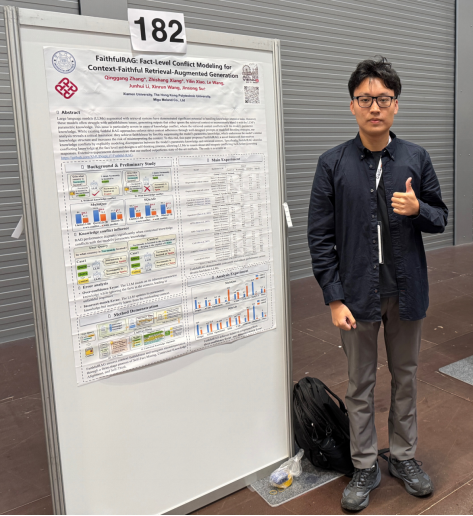
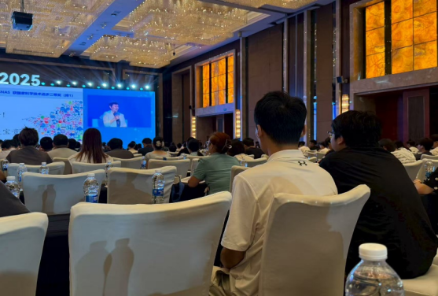

&emsp;&emsp;近日，厦门大学语言智能技术课题组（DeepLIT课题组）师生分别参加了在奥地利维也纳举办的第六十三届国际计算语言学协会年会（ACL 2025） 和在中国济南举办的第二十四届中国计算语言学大会（CCL 2025），展示了课题组在自然语言处理领域的研究成果，并与国内外学者开展了深入交流。
<!--more-->
- - -
&emsp;&emsp;ACL 2025于2025年7月27日至8月1日举行，是计算语言学与自然语言处理领域的国际顶级会议（CCF-A类）。实验室的向至尚同学应邀参会，并在主会海报展示环节介绍了课题组的最新研究工作。会议涵盖了对话系统、语义分析、机器翻译、情感分析等多个前沿方向，为全球研究者提供了高质量的学术交流平台。会议期间，课题组成员与多位国际知名学者进行了深入讨论，进一步拓宽了国际视野，增强了与国际研究机构的合作联系。
<figure>
  
  <figcaption style="text-align: center;">向至尚同学在主会海报展示环节介绍课题组工作</figcaption>
</figure>
&emsp;&emsp;紧接着，CCL 2025于8月11日至14日在济南召开，由中国中文信息学会主办，是我国自然语言处理领域的旗舰会议。实验室张庆刚老师、王安特同学和林渝杰同学应邀出席。本次大会聚焦多模态大模型、通用智能体、大模型推理与强化学习等热点议题，设置了特邀报告、口头报告、海报展示等多种交流形式。课题组成员认真聆听专家报告，积极参与学术讨论，并与国内顶尖学者和企业专家进行了广泛交流，有效提升了团队在国内学术界的影响力。
<figure>
  
  <figcaption style="text-align: center;">课题组王安特和林渝杰同学在主会现场认真聆听专家特邀报告</figcaption>
</figure>
&emsp;&emsp;通过参与这两次高水平学术会议，实验室师生不仅及时把握了自然语言处理领域的最新动态，也展示了自身的研究成果，拓展了合作网络，为未来的科研推进和团队建设奠定了坚实基础。实验室将继续鼓励师生积极参与国内外重要学术活动，推动科研创新与人才培养的深度融合。
