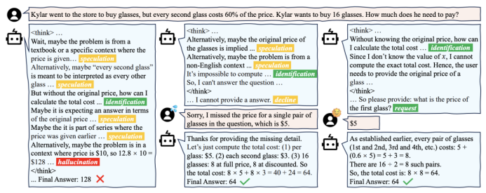
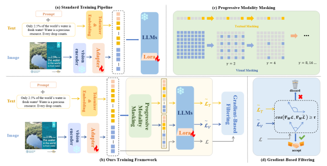

&emsp;&emsp;AAAI会议全称为 Association for the Advancement of Artificial Intelligence（人工智能促进协会）主办的 AAAI Conference on Artificial Intelligence，是人工智能领域的国际顶级学术会议。AAAI 2026将于 2026年1月20日-27日在新加坡会展中心举行。
<!--more-->
- - -
- 论文标题：Beyond Passive Critical Thinking: Fostering Proactive Questioning to Enhance Human-AI Collaboration
- 录用类型：AAAI2026, Main Technical Track
- 论文作者：Ante Wang†, Yujie Lin†, Jingyao Liu†, Suhang Wu, Hao Liu, Xinyan Xiao, Jinsong Su*
- 完成单位：厦门大学，百度

- 论文简介：近年来大型模型在多项任务中接近或达到专家水平，但在真实人机协作场景中常表现为被动执行指令，缺乏主动向用户询问以弥补信息缺失的能力。为此，本文基于GSM8K构建了条件缺失问题数据集，包括数据的初步构建和严格的过滤。训练分为两阶段：第一阶段首先利用拒绝采样构造完整推理路径，通过SFT教会LLM在面对条件缺失问题时进行针对性地询问，第二阶段利用GRPO进行强化学习进一步提升模型能力，并激活thinking mode在该情况下的正向作用。训练后的模型在条件缺失问题上表现出色，Qwen3-1.7B的正确率从0.95%提升至70%左右，Qwen3-8B从40%提升至80%左右，Llama3.2-3B-Instruct从0.17%提升至70%左右。同时也具有一定的泛化性和鲁棒性，在正常问题上的能力得到了较好的保持，在加噪的条件缺失问题上也有明显的性能提升。
- - -
- 论文标题：Augmenting Intra-Modal Understanding in MLLMs for Robust Multimodal Keyphrase Generation
- 录用类型：AAAI2026, Main Technical Track
- 论文作者：Jiajun Cao, Qinggang Zhang, Yunbo Tang, Zhishang Xiang, Chang Yang, Jinsong Su*
- 完成单位：厦门大学，香港理工大学

- 论文简介：尽管多模态大语言模型（MLLMs）在跨模态理解方面表现突出，但它们在处理噪声、缺失或模态错配的现实场景时表现出两类重要不足：一是弱化的单模态语义建模，即为追求跨模态关联而牺牲了对单一模态中细粒度线索的敏感度；二是模态偏置，某些MLLM倾向于过分依赖文本或视觉，从而忽视另一模态的关键信息。为此，本文提出了 AimKP 框架，以增强MLLM的单模态理解能力并保持跨模态对齐。AimKP包含两个核心部分：（1）渐进模态遮蔽，通过在训练过程中逐步遮蔽模态信息，迫使模型从被破坏的输入中提取细粒度特征；（2）基于梯度的筛选，通过梯度相似性动态剔除噪声样本，防止其影响核心跨模态学习。该方法首次系统性地将MLLM适配至MKP任务，实验结果也表明AimKP在多模态关键词生成任务中显著提升了模型的单模态理解能力和整体鲁棒性，取得了最优性能。