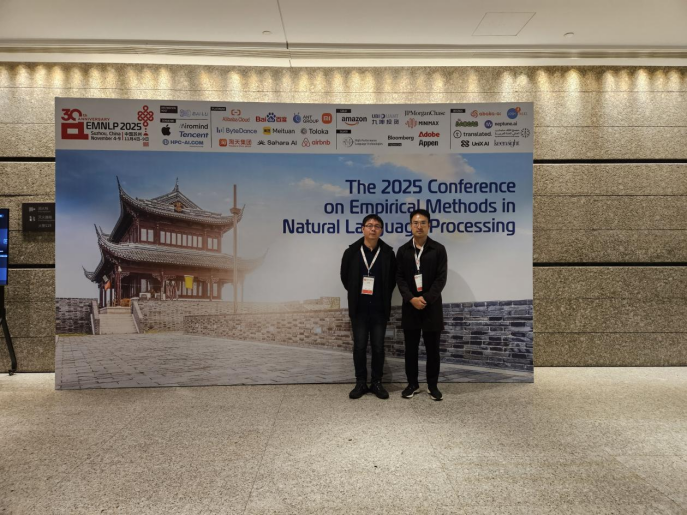

&emsp;&emsp;2025年11月上旬，DeepLIT课题组相继参与了在成都与苏州举办的两场人工智能领域顶级学术会议——第四届全国大模型智能生成大会（LMG 2025）与第二十一届自然语言处理实证方法会议（EMNLP 2025）。课题组师生不仅通过大会报告、海报展示等形式与国际同行进行了深度学术交流，其研究成果亦荣获“亮点海报”奖，充分展现了团队在前沿领域的创新活力与国际化学术影响力。
<!--more-->
- - -
&emsp;&emsp;2025年11月1日至11月3日，第四届全国大模型智能生成大会（LMG 2025）在四川成都举行。本次大会由中国中文信息学会大模型与生成专委会主办，以“智汇天府，生成艺境”为主题，全面聚焦智能生成领域的前沿探索与技术突破。本次大会吸引了全国近千名专家学者共襄盛会，碰撞思想、交流成果、共绘未来蓝图。DeepLIT课题组苏劲松老师率领八位课题组成员全程参与了本次学术盛会。
<figure>
  
  <figcaption style="text-align: center;">DeepLIT课题组师生合影</figcaption>
</figure>
&emsp;&emsp;大会主论坛特邀多位国内外院士、资深学者及产业界领军人物作权威报告。研讨内容涵盖大模型基础理论、深度推理、安全对齐、多模态生成、科学智能、具身智能、智能体及人文艺术智能等前沿方向，通过16场专题分论坛与4场前沿讲习班，系统梳理了相关领域的研究进展与发展趋势。胡事民院士提出了推理评测基准与国产算力生态构建路径，文继荣教授深入阐释了AGI的规模法则与扩散语言模型新范式，周海宏教授从认知科学视角解析了生成式人工智能的创新路径，王立威教授重构了机器学习在大模型时代的理论体系，华为云专家则分享了推理服务的最新工程实践。本次大会有效促进了产学研深度融合，为推动生成式人工智能的关键技术突破与未来发展方向提供了重要洞见。
本次大会的海报交流会作为重要的学术互动环节，成功营造了高活跃度的交流氛围。活动集中展示了百余篇精选自顶级会议的学术成果，课题组师生与国内外同行进行了零距离深度研讨。经与会代表以小红花粘贴方式进行现场评议，DeepLIT课题组刘冰帅、王安特、闵子君的研究海报凭借其创新性获得学界广泛认可，荣膺本届大会“亮点海报”奖。
<figure>
  
  <figcaption style="text-align: center;">DeepLIT课题组海报荣获“亮点海报”奖</figcaption>
</figure>

&emsp;&emsp;继成都会议之后，第二十一届自然语言处理实证方法会议（EMNLP 2025）于2025年11月5日至9日在苏州隆重举行。作为国际计算语言学协会（ACL）旗下最具影响力与权威性的学术会议之一，EMNLP始终是全球自然语言处理（NLP）学者展示前沿成果、交流学术思想的核心平台。本届大会吸引了来自世界各地的顶尖学者、研究人员及产业界代表，共同探讨NLP领域的最新突破与未来愿景。DeepLIT课题组的苏劲松老师和李辉博士应邀参会。
<figure>
  
  <figcaption style="text-align: center;">苏劲松老师与李辉博士合影</figcaption>
</figure>
&emsp;&emsp;本届大会议程设置丰富多元，除主旨报告、专题研讨会、长短期论文报告、海报展示及工业界展览等经典环节外，更聚焦于大模型时代的核心挑战与前沿探索。与会学者重点研讨了大语言模型的推理与对齐、智能体、高效微调、可信赖生成等关键议题，并就多模态与具身智能、低资源语言处理、以及NLP在生物医药、科学计算等交叉领域的创新应用展开了深度交流。现场学术氛围浓厚，课题组师生也就相关研究方向与国际同行进行了富有成效的探讨，为后续工作带来了重要启发。

&emsp;&emsp;在备受关注的海报展示环节，DeepLIT课题组的李辉博士展示了课题组的最新研究成果。他们的研究工作引发了众多国际同行的浓厚兴趣，在场学者们纷纷驻足交流，提出了许多富有建设性的意见，为后续研究的深化提供了宝贵思路。

&emsp;&emsp;通过参与这两场高水平学术会议，DeepLIT课题组成员不仅拓展了学术视野，更与国内外顶尖学者建立了持续合作的桥梁，为准确把握领域国际前沿动态、规划未来科研方向注入了新的动力。

