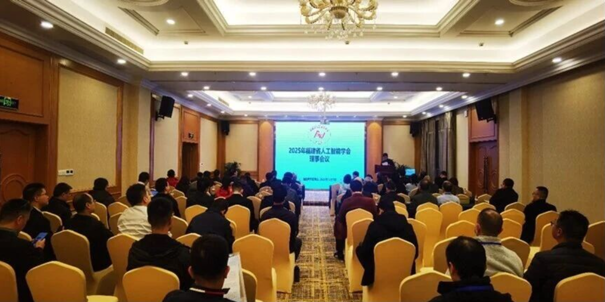

&emsp;&emsp;福建省人工智能学会2025年学术年会暨闽台非遗数字文化基因会议”于2025年12月5日至7日在武夷山召开。会议由福建省人工智能学会主办、福建省茶产业大数据应用与智能化重点实验室（武夷学院）承办。课题组苏劲松老师，李辉博士，杨成义、贾凯迪、刘陈清和侯爵同学参与了此次盛会。
<figure>
    
</figure>
<!--more-->

&emsp;&emsp;本次年会聚焦“人工智能+文化”融合发展，助力文化遗产保护传承与相关产业协同。大会上，浙江大学潘刚、北京理工大学宋维涛等专家学者围绕脑机智能、文化遗产数字化、大模型新趋势等前沿主题作出报告并深入研讨。课题组成员积极参与学术讨论，拓展了视野，深化了对相关领域的理解。

&emsp;&emsp;此次参会让课题组与省内外顶尖学者充分交流，收获了“人工智能+文化”领域前沿理念与科研建议，为课题组把握交叉创新趋势、优化科研规划提供了重要参考。