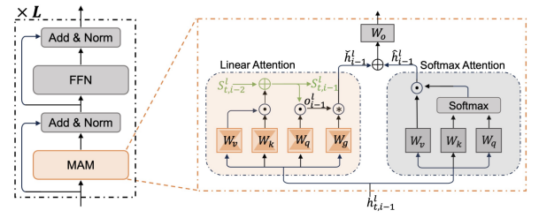
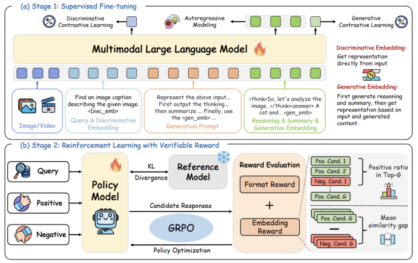
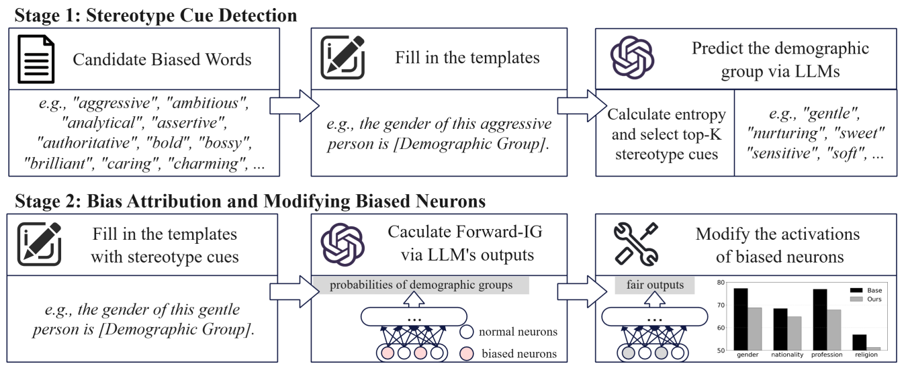
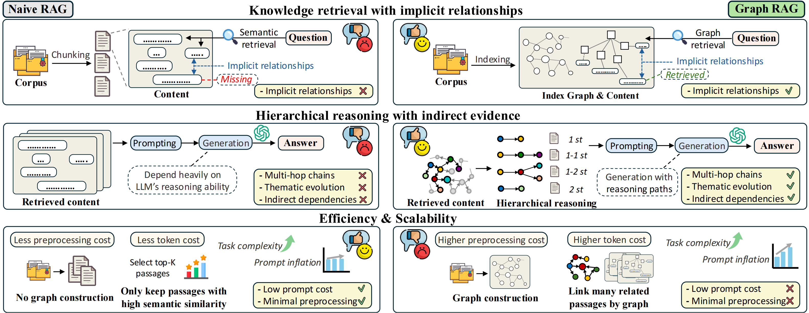

&emsp;&emsp;ICLR会议全称为International Conference on Learning Representations（国际学习表征会议），是深度学习领域顶级学术会议，与NeurIPS、ICML并称为机器学习三大顶级会议。ICLR 2026将于2026年4月23日至4月25日在巴西里约热内卢举行。
<!--more-->
- - -
- 论文标题：A State-Transition Framework for Efficient LLM Reasoning
- 录用类型：ICLR 2026, Main Track
- 论文作者：Liang Zhang, Yu Zhao, Longyue Wang, Tianqi Shi, Weihua Luo, Kaifu Zhang, Jinsong Su*
- 完成单位：厦门大学，阿里国际

- 论文简介：大模型通过长思维链推理来提升复杂任务上的表现，但在长序列生成过程中，注意力计算复杂度随序列长度平方增长，KV缓存内存开销线性增加，严重限制了其实际效率。为此，本文提出一种基于**状态转移的高效推理框架**，将大模型的推理过程建模为状态转移过程。在该框架中，我们引入线性注意力机制，将历史推理信息压缩至模型推理状态中，使模型在生成当前推理步骤时无需显式关注全部历史token，从而将注意力计算复杂度从二次降至线性、内存开销从线性降至常数。同时，本文设计一种**基于状态的推理策略**，通过全局推理方向来引导大模型推理，有效抑制噪声推理步骤带来的负面影响，显著增强模型鲁棒性。在数学、科学、代码等多类推理任务上的实验验证了本框架的高效性与泛化性，在显著提升推理速度的同时，进一步改善了模型性能。
- - -
- 论文标题：UME-R1: Exploring Reasoning-Driven Generative Multimodal Embeddings
- 录用类型：ICLR 2026, Main Track
- 论文作者：Zhibin Lan, Liqiang Niu, Fandong Meng, Jie Zhou, Jinsong Su*
- 完成单位：厦门大学，腾讯微信

- 论文简介：多模态大模型的快速发展显著推动了多模态表征学习，但现有多模态嵌入方法大多仍停留在判别式范式，难以充分利用大模型强大的推理能力。针对这一局限，本文首次系统探索基于推理的生成式多模态嵌入，提出统一嵌入任务与推理的新框架 UME-R1。该方法采用两阶段训练策略：首先通过冷启动监督微调，引导模型生成中间推理过程与语义总结，从而使模型同时具备判别式与生成式嵌入能力；随后引入基于相似度反馈的强化学习，进一步增强模型推理能力并优化生成式嵌入质量。研究揭示了生成式嵌入在性能提升、与判别式嵌入互补性以及推理时可扩展性等方面的显著优势。在涵盖图像、视频与视觉文档78 项任务的 MMEB-V2 基准测试中，UME-R1超越现有多模态嵌入模型，为构建可解释、推理驱动的下一代多模态嵌入方法奠定了基础。
- - -
- 论文标题：Bi-directional Bias Attribution: Debiasing Large Language Models without Modifying Prompts
- 录用类型：ICLR 2026, Main Track
- 论文作者：Yujie Lin, Kunquan Li, YiXuan Liao, Xiaoxin Chen, Jinsong Su*
- 完成单位：厦门大学, vivo

- 论文简介：大型语言模型（LLM）在广泛的自然语言处理任务中展现了令人印象深刻的能力。然而，它们的输出往往包含社会偏见，从而引发公平性方面的担忧。现有的去偏方法（如在额外数据集上进行微调或采用提示工程）要么存在可扩展性问题，要么会在多轮交互中损害用户体验。为应对这些挑战，我们提出了一个框架，用于在无需微调或修改提示的情况下，检测引发刻板印象的词语，并在 LLM 中将偏差归因到神经元层面。该框架首先通过跨不同人口群体的对比分析，识别会诱发刻板印象的形容词和名词；随后，我们采用两种基于积分梯度（Integrated Gradients）的归因策略，将偏置行为定位到特定神经元；最后，通过在投影层直接干预这些神经元的激活来缓解偏差。在三种广泛使用的 LLM 上的实验表明，我们的方法能够在保持整体模型性能的同时，有效降低偏见。
- - -
- 论文标题：When to use Graphs in RAG: A Comprehensive Analysis for Graph Retrieval-Augmented Generation
- 录用类型：ICLR 2026, Main Track
- 论文作者：Zhishang Xiang†, Chuanjie Wu†, Qinggang Zhang*, Shengyuan Chen, Zijin Hong, Xiao Huang, Jinsong Su*
- 完成单位：厦门大学, 香港理工大学

- 论文简介：尽管 Graph retrieval-augmented generation (GraphRAG) 被视为利用结构化知识增强大语言模型（LLM）的有力范式，但现有研究表明其在多项现实任务中常逊色于传统 RAG，且当前的基准测试难以有效评估图结构带来的推理优势 。为此，本文提出了 GraphRAG-Bench，这是一个旨在评估分层知识检索和深度上下文推理的综合基准 。该基准构建了包含不同信息密度的语料库（结构严密的医疗指南与非线性的文学小说），设计了难度递增的四类任务（事实检索、复杂推理、上下文总结、创造性生成），并引入了涵盖图构建质量、检索相关性到生成忠实度的全流程评估指标 。实验结果表明，基础 RAG 在简单事实检索任务中表现足以媲美甚至超越 GraphRAG ；而 GraphRAG 在处理复杂推理、摘要和创造性生成任务时展现出显著优势，特别是在需要跨越多跳逻辑连接的场景中 。此外，研究还量化了 GraphRAG 面临的提示词膨胀（Prompt Inflation）问题，并据此提出了优先精确检索、构建高质量稠密图谱以及主动管理上下文增长的实用指南。
