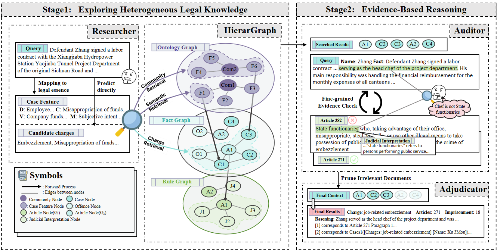
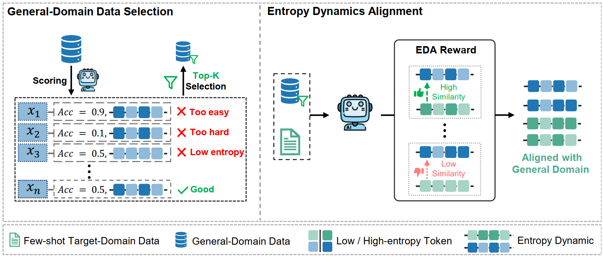
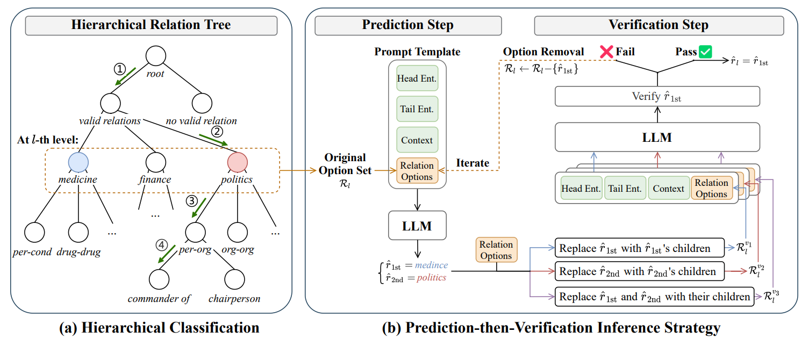
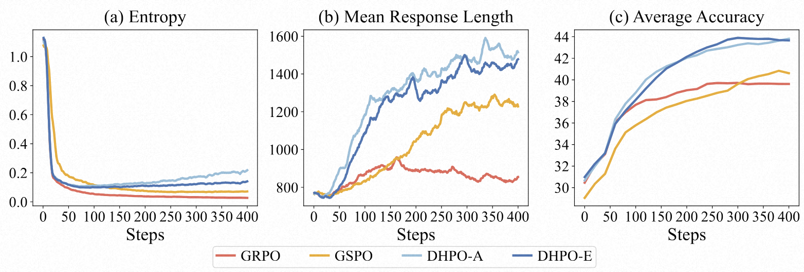
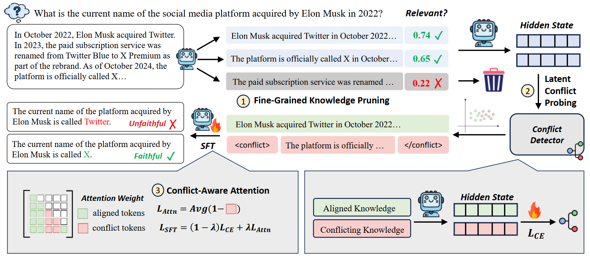
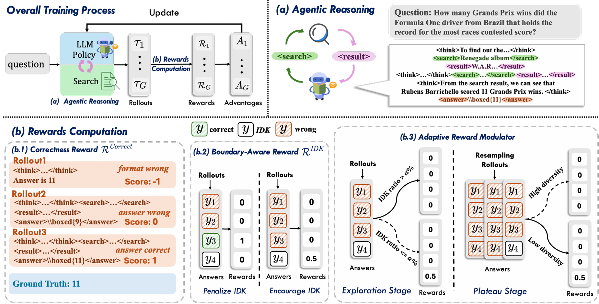

&emsp;&emsp;ACL 2026 是国际计算语言学协会（Association for Computational Linguistics, ACL）举办的年度旗舰会议，是自然语言处理（NLP）和计算语言学领域的顶级学术会议之一。ACL 2026将于2026年7月2日至7月7日在美国圣地亚哥举行。
<!--more-->
- - -
- 论文标题：LegalGraphRAG: Multi-Agent Graph Retrieval-Augmented Generation for Reliable Legal
Reasoning
- 录用类型：ACL 2026, Main, Long paper
- 论文作者：Zerui Chen, Qinggang Zhang*, Zhishang Xiang, Zhimin Wei, Linfeng Gao, Xiao Huang, Zhihong Zhang*, Jinsong Su*
- 完成单位：厦门大学，香港理工大学

- 论文简介：基于图的检索增强生成（GraphRAG）在处理专业领域任务中展现出巨大潜力，然而，将其应用于法律推理等严谨的垂直领域时却面临着重大挑战。现有的扁平图结构无法有效处理包含案例、法条和司法解释的异构多粒度法律知识，限制了检索的准确性；同时，传统的RAG系统往往在未经验证的情况下直接将上下文传递给大语言模型，导致“检索-生成”的推理过程不透明且易产生错误。针对这些痛点，本研究提出了创新性的LegalGraphRAG框架。该框架引入了多层级法律图谱，实现了对多粒度法律信息的高效组织与精准检索；此外，系统设计了一个多智能体工作流，通过检索候选证据、严格验证其有效性并对核实的证据进行综合分析，将法律判决转化为透明的证据驱动流水线。大量的实验结果表明，该方法不仅超越了现有的GraphRAG基准和专业法律大模型，还能确保每一项结论都具备清晰的法律证据支撑，显著提高了生成结果的准确性与可信度。
- - -
- 论文标题：HEALing Entropy Collapse: Enhancing Exploration in Few-Shot RLVR via Hybrid-Domain Entropy Dynamics Alignment
- 录用类型：ACL 2026, Main, Long paper
- 论文作者：Zhanyu Liu†, Qingguo Hu†, Ante Wang, Chenqing Liu, Zhishang Xiang, Hui Li, Delai Qiu, Jinsong Su*
- 完成单位：厦门大学，厦门云知芯，清华大学

- 论文简介：基于可验证奖励的强化学习（RLVR）在训练推理导向的大语言模型方面已展现出显著成效，但现有方法大多假设资源充足、训练数据丰富。在低资源场景下，RLVR 极易遭遇更为严重的熵坍缩问题，这极大地限制了探索空间，并削弱了推理性能。为此，我们提出混合域熵动态对齐（HEAL）框架，专为少样本 RLVR 设计。HEAL 首先有选择地融入高价值通用域数据，以促进更多样化的探索。随后，我们引入熵动态对齐（EDA）奖励机制，该机制能够对齐目标域与通用域之间的轨迹级熵动态，不仅捕捉熵的大小，还刻画其精细变化。通过这种对齐，EDA 不仅进一步缓解了熵坍缩，还鼓励策略从通用域习得更丰富的探索行为。跨多个领域的实验结果表明，HEAL 能够持续提升少样本 RLVR 的性能。值得注意的是，仅使用 32 条目标域样本，HEAL 即可达到甚至超越使用 1000 条目标域样本训练的全量 RLVR 模型水平。
- - -
- 论文标题：HCRE: LLM-based Hierarchical Classification for Cross-Document Relation Extraction with a Prediction-then-Verification Strategy
- 录用类型：ACL 2026, Findings, Long paper
- 论文作者：Guoqi Ma†, Liang Zhang†, Hongyao Tu, Hao Fu, Hui Li, Yujie Lin, Longyue Wang, Weihua Luo, Jinsong Su*
- 完成单位：厦门大学，理想汽车，阿里国际

- 论文简介：现有的跨文档关系抽取研究主要基于“小语言模型+分类头”的范式，要求模型在一次推断过程中从大量语义相似的候选关系中选择出目标关系。然而，这一范式对于语义建模能力有限的小语言模型构成了巨大的挑战。为此，本文提出基于大语言模型层级式分类方法。具体而言，本方法首先根据预定义关系的语义信息进行递归地划分和抽象，构建由高层概念节点到细粒度关系节点逐级展开的层次关系树；随后，在树结构的引导下，大语言模型进行逐层地、自上而下的层级式分类，每次预测从少量的树节点进行选择，从而显著降低单步分类难度。更进一步地，为了缓解层级式分类过程中的错误传播问题，本文设计一种预测验证策略，在每一层级引入细粒度节点信息对当前预测进行一致性检验，提升模型预测的可靠性。该方法首次系统性地将大语言模型适配至跨文档关系抽取任务，实验结果也表明本方法在封闭和开放设置中均取得了最优性能，验证了有效性。
- - -
- 论文标题：Orchestrating Tokens and Sequences: Dynamic Hybrid Policy Optimization for RLVR
- 录用类型：ACL 2026, Findings, Long paper
- 论文作者：Zijun Min†, Bingshuai Liu†, Ante Wang, Long Zhang, Anxiang Zeng, Haibo Zhang, Jinsong Su*
- 完成单位：厦门大学，虾皮，清华大学

- 论文简介：可验证奖励强化学习（RLVR）为优化大语言模型的推理能力提供了一个极具潜力的框架。然而，现有 RLVR 算法所关注的优化粒度各不相同，且各自的优势与局限互为补充。组相对策略优化（GRPO）利用词元级重要性比率更新策略，保留了细粒度的功劳分配，但往往面临方差高、训练不稳定的问题。相比之下，组序列策略优化（GSPO）对生成回复中的所有词元统一应用单一的序列级重要性比率，虽能更好地对齐序列级奖励，却牺牲了词元级的信用分配能力。为此，本文提出动态混合策略优化（Dynamic Hybrid Policy Optimization, DHPO），旨通过单一的裁剪函数桥接 GRPO 与 GSPO。DHPO 通过加权机制将词元级与序列级的重要性比率相融合。我们深入探讨了两种混合机制变体：平均混合与熵引导混合。为进一步提升训练稳定性，我们引入了分支特异性裁剪策略，在混合前分别将词元级与序列级比率约束在各自独立的信任域内，从而有效避免任一分支的异常值主导参数更新。在七项高难度数学推理基准测试中，DHPO 的性能始终稳定优于 GRPO 与 GSPO。
- - -
- 论文标题：Beyond Black-Box Interventions: Latent Probing for Faithful Retrieval-Augmented Generation
- 录用类型：ACL 2026, Findings, Long paper
- 论文作者：Linfeng Gao, Qinggang Zhang, Baolong Bi, Bo Zeng, Zheng Yuan, Zerui Chen, Zhimin Wei, Shenghua Liu, Linlong Xu, Longyue Wang, Weihua Luo, Jinsong Su*
- 完成单位：厦门大学，阿里云

- 论文简介：检索增强生成（RAG）系统常常难以保持对上下文的忠实性，生成的回答可能与提供的上下文相冲突。现有方法尝试通过外部干预来提升忠实性，例如使用特殊提示、基于解码的校准或偏好优化。然而，由于这些方法将大语言模型视为黑箱，它们缺乏可靠的机制来评估冲突是如何发生的。因此，这些方法往往脆弱、依赖大量数据，并且无法洞察模型的内部推理过程。在本文中，我们超越黑箱式干预，转向分析模型的内部推理机制。我们发现，在模型的潜在空间中，冲突知识状态与一致知识状态是线性可分的，而上下文噪声会系统性地增加这些表示的熵。基于这些发现，我们提出了 ProbeRAG，这一全新的忠实 RAG 框架包含三个阶段：（i）细粒度的知识剪枝，用于过滤无关上下文；（ii）潜在冲突探测，用于识别模型潜在空间中的硬冲突；（iii）基于冲突的注意力机制，用于调整注意力头，使其更好地整合忠实的上下文。实验表明，ProbeRAG 在准确性和上下文忠实性方面都取得了显著提升。
- - -
- 论文标题：BAPO: Boundary-Aware Policy Optimization for Reliable Agentic Search
- 录用类型：ACL 2026, Findings, Long paper
- 论文作者：Shiyu Liu, Yongjing Yin, Jianhao Yan, Yunbo Tang, Qinggang Zhang, Bei Li, Xin Chen, Jingang Wang, Xunliang Cai, Jinsong Su*
- 完成单位：厦门大学，美团，香港理工大学

- 论文简介：尽管当前基于 RL 训练的深度搜索Agent（如 Search-R1 等）通过在推理中自主搜索显著提升了多跳 QA 的性能，但我们的先导实验揭示了一个被忽视的严重问题：基于正确性奖励的RL削弱了模型的推理边界意识。
这些 Agent 在搜索不到有效信息时，往往缺乏承认“I Don’t Know” (IDK) 的能力，反而倾向于根据上下文强行编造答案，极易误导用户，成为 Agent 落地实际应用的关键阻碍。为此，我们提出了一套系统性的 RL 框架 —— BAPO，旨在训练更可信的搜索 Agent：1. 边界感知奖励 (Boundary-Aware Reward)： 基于 GRPO 的组优势算法，我们引入了针对性的奖励机制。对于不存在正确答案的样本组，奖励 IDK 回复，反之则惩罚。这迫使模型习得精准的边界意识，学会拒绝回答超出能力范围或检索信息不足的问题。2. 动态奖励调和器 (Adaptive Reward Modulator)： 仅仅鼓励 IDK 可能会导致模型“变懒”，丧失解决难题的探索欲。我们设计了一个动态调和机制，在早期探索阶段抑制 IDK 奖励，优先鼓励探索；随着训练进行，逐步强化边界约束，有效平衡了“解题能力”与“边界意识”。在 HotpotQA、Musique 等多跳问答数据集上的实验表明，仅用5k的训练样本，BAPO有效提升了 Agent 回答精准率和整体可靠性指标，在培养模型边界意识的同时，仍能保持与 GRPO 相近的准确率。

- - -

此外，课题组还有5篇合作论文被ACL 2026录用：
- Rui Zhao, Xuewen Zhong, Xiaoyun Zheng, Jinsong Su, and Yidong Chen. 2026. CNSL-bench: Benchmarking the Sign Language Understanding Capabilities of MLLMs on Chinese National Sign Language. In Proceedings of ACL 2026.
- Chang hao lai, Rui Zhao, Xuewen Zhong, Jinsong Su, and Yidong Chen. 2026. Selective Contrastive Learning For Gloss Free Sign Language Translation. In Proceedings of ACL 2026. 
- Junchao Wu, Yefeng Liu, Chenyu Zhu, Hao Zhang, Zeyu Wu, Tianqi Shi, Yichao Du, Longyue Wang, Weihua Luo, Jinsong Su, and Derek F. Wong. 2026. DetectRL-X: Towards Reliable Multilingual and Real-World LLM-Generated Text Detection. In Proceedings of ACL 2026.
- Zhiwen Ruan, Yichao Du, Jianjie Zheng, Longyue Wang, Yun Chen, Peng Li, Jinsong Su, Yang Liu, and Guanhua Chen. 2026. GIFT: Guided Fine-Tuning and Transfer for Enhancing Instruction-Tuned Language Models. In Proceedings of ACL 2026. 
- Lingling Shi, Haoyu Jin, Ruiyu Fang, Shuangyong Song, Jinsong Su, Yongxiang Li, and Xuelong Li. 2026. CEMT：Controllable Element-Oriented Machine Translation via Structured Linguistic Reasoning. In Proceedings of ACL 2026 findings.