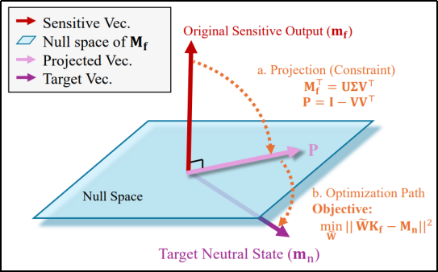
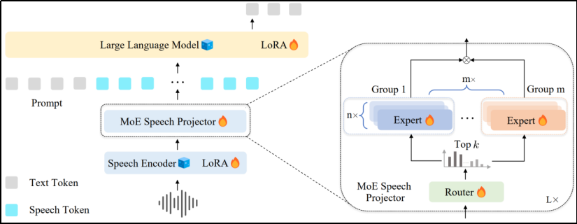
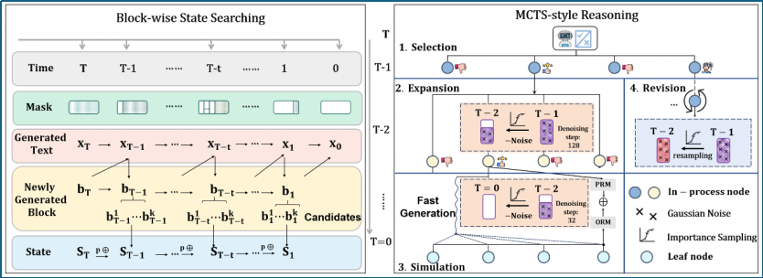

&emsp;&emsp;近日，DeepLIT课题组3篇论文被国际权威会议录用。ICML 2026会议全称为The Forty-Third International Conference on Machine Learning，在CCF学术推荐列表中被认定为A类会议，并将于2026年7月6日至11日在韩国首尔举行。IJCAI-ECAI 2026会议全称为The 35th International Joint Conference on Artificial Intelligence，在CCF学术推荐列表中被认定为B类会议，并将于2026年8月15日至21日在德国不来梅举行。此次被录用的论文的相关信息如下：
<!--more-->
- - -
- 论文标题：ZeroUnlearn: Few-Shot Knowledge Unlearning in Large Language Models
- 录用类型：ICML 2026, Main Track
- 论文作者：Yujie Lin+, Chengyi Yang+, Zhishang Xiang, Yiping Song, Jinsong Su*
- 完成单位：厦门大学，国防科技大学

- 论文简介：随着大语言模型在搜索、对话、内容生成等场景的深度普及，模型训练中不可避免记忆大量敏感数据、隐私信息与过时知识，引发数据合规、隐私泄露及内容安全风险。机器遗忘作为解决该问题的关键技术，旨在让模型定向忘掉指定知识。现有遗忘方法存在明显短板：全量重训练计算成本极高，超大规模模型难以工程落地；激进微调易引发“连带遗忘”，删除目标知识的同时破坏语义相关良性知识，导致模型语言能力、生成质量及通用任务性能大幅下降。因此，小样本条件下实现精准、高效、无损的知识擦除，成为大模型安全领域的核心挑战。针对上述痛点，我们创新将机器遗忘转化为基于模型编辑的精准知识重映射问题，提出小样本知识遗忘框架ZeroUnlearn。其核心是不破坏性扰动模型权重，将敏感输入映射到中性目标状态，并通过乘法参数更新强制编辑后表征与原始敏感表征正交化，从特征空间彻底消除敏感知识影响。
- - -
- 论文标题：Towards Fine-Grained Code-Switch Speech Translation with Semantic Space Alignment
- 录用类型：IJCAI-ECAI 2026, Main Track
- 论文作者：Yan Gao, Yazheng Yang*, Zhibin Lan, Yidong Chen, Min Zhang, Daimeng Wei, Derek F. Wong, Jinsong Su*
- 完成单位：厦门大学，华为，澳门大学

- 论文简介：该论文针对语码转换语音翻译任务中语义建模复杂性与数据稀缺两大挑战展开研究。现有方法通常依赖模型自身去隐式学习跨语言语义，并使用成本高昂的标注数据或质量欠佳的合成数据，限制了模型在语码转换场景下的能力。本研究发现，不同语言的语音特征在语义空间中存在显著差异，且共享投影器难以有效捕捉跨语言语义差异。为解决这一问题，我们提出了一套结合模型架构与训练策略的解决方案。具体而言，在架构层面我们设计了混合专家投影器，将专家按语言分组，使各组专注于特定语言的语义空间，实现对语音特征的细粒度建模。在训练层面则引入多阶段训练范式，充分利用易获取的单语语音识别与翻译数据来强化语义对齐与翻译能力，提出迁移学习损失逐步适配到语码转换语音翻译场景，并提出语言特定损失与组内负载均衡损失确保专家组间的专业化与专家组内的负载均衡。
- - -
- 论文标题：DiffuReason: Enhancing Reasoning Ability for Diffusion Language Models via Monte Carlo Tree Search
- 录用类型：ICML 2026, Main Track
- 论文作者：Yiping Song, Jinyu You, Zhiliang Tian, Jinsong Su, Minlie Huang, Chenping Hou
- 完成单位：国防科技大学，厦门大学

- 论文简介：自回归大模型结合树搜索的“慢思考”范式在复杂推理中表现优异，但其串行生成机制导致了极高的计算延迟。扩散大语言模型虽具备并行生成的高效优势，却因连续降噪过程缺乏离散决策节点，难以直接融入深层的逻辑规划与纠错机制。为此，本文提出一种专为扩散大语言模型定制的高效搜索推理框架DiffuReason。该算法将连续的扩散流离散化为可搜索的语义“思维块”，把生成过程重构为马尔可夫决策过程，从而打破了连续生成与离散规划的架构壁垒。在此基础上，框架地引入了“原位修正”机制，极致利用扩散模型的双向注意力特性，对低置信度区间进行精准的局部重掩码修复。在多项复杂数学与代码基准上的严格控制实验表明，该框架在大幅降低搜索延迟的同时显著增强了逻辑准确性。

