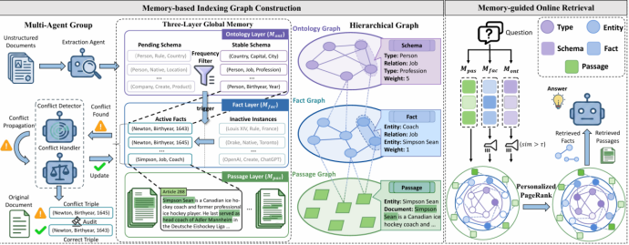
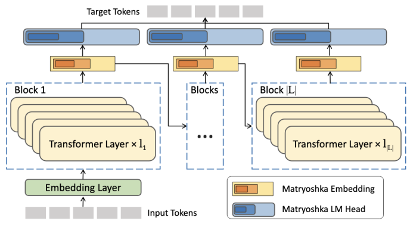

&emsp;&emsp;KDD 2026全称为第32届ACM SIGKDD知识发现与数据挖掘会议（ACM SIGKDD Conference on Knowledge Discovery and Data Mining），是数据挖掘与数据科学领域的国际顶级学术会议，被中国计算机学会列为A类会议。KDD 2026将于2026年8月9日至13日在韩国济州国际会议中心举行。
<!--more-->
- - -
- 论文标题：MemGraphRAG: Memory-based Multi-Agent System for Graph Retrieval-Augmented Generation
- 录用类型：KDD 2026, Main Conference, Research Track，18.5%录用率
- 论文作者：Chuanjie Wu+, Zhishang Xiang+, Yunbo Tang, Zerui Chen, Qinggang Zhang*, Jinsong Su*
- 完成单位：厦门大学，吉林大学

- 论文简介：基于图的RAG（GraphRAG）通过引入知识图谱来捕捉结构化关系，从而支持更全面的检索，并增强复杂推理能力。然而，现有GraphRAG方法在图构建过程中通常依赖孤立的片段级信息抽取，缺乏面向整个语料库的全局视角。因此，这些方法往往会生成主题不一致、逻辑相冲突且结构碎片化的图，进而降低检索性能。
本文提出 MemGraphRAG框架，通过引入基于记忆的多智能体系统来实现高质量的图构建。具体而言，MemGraphRAG采用由共享记忆支持的协作式智能体集群，在整个抽取过程中提供统一的全局上下文。该机制使智能体能够解决抽取过程中的逻辑冲突，并在整个语料库范围内维持结构一致性。此外，我们提出了一种面向所构建图的记忆感知层次化检索算法。多个基准数据集上的大量实验表明，MemGraphRAG 在保持相当效率的同时，优于当前最先进的基线模型。
- - -
- 论文标题：m³BERT: A Modern, Multi-lingual, Matryoshka Bidirectional Encoder
- 录用类型：KDD 2026, Main Conference, ADS Track，19.8%录用率
- 论文作者：Yaoxiang Wang, Simiao Zuo, Qingguo Hu, Yucheng Ding, Yeyun Gong*, Jian Jiao, Jinsong Su*
- 完成单位：厦门大学，上海交通大学，微软

- 论文简介：传统嵌入模型通常只能生成固定维度表示，在低延迟、低存储等工业部署场景下往往需要额外裁剪或蒸馏，导致预训练能力无法充分继承。为解决这一问题，本文提出m³BERT。该方法首次将Matryoshka Representation Learning引入模型预训练过程，在Transformer层数与嵌入维度两个粒度上联合优化表示学习，使单一模型即可支持不同深度与不同维度配置下的高效部署。同时，模型融合SwiGLU等架构改进，并采用英文预训练、多语言适配与领域持续预训练的三阶段训练范式，增强模型在多语言工业检索场景中的泛化能力。实验表明，m³BERT在大规模工业检索数据集上显著优于现有主流模型，尤其在低维、低层数配置下表现出优异性能。