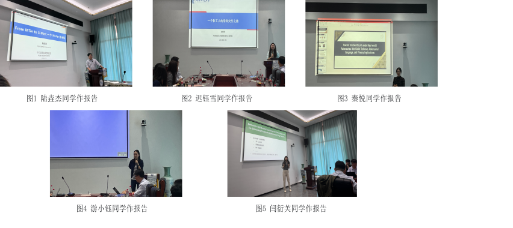

&emsp;&emsp;近日，应课题组邀请，多位已毕业并在高校、科研院所任职的学长学姐重返母校，开展成长与科研经验分享交流活动。学长学姐们结合从厦大毕业后的求学、科研与工作经历，围绕学术发展、职业选择、科研训练和个人成长等话题，与在校同学深入交流。
<!--more-->
- - -
&emsp;&emsp;本次活动邀请到陆垚杰（16届毕业生，现为中科院软件所副研究员）、迟钰雪（15届毕业生，现为中央财经大学管理科学与工程学院副教授）、闫衍芙（16届毕业生，现为浙江大学计算机科学与技术系助理教授）、秦悦（18届毕业生，现为中央财经大学信息学院助理教授）、游小钰（17届毕业生，现为华东理工大学信息科学与工程学院讲师）等校友参加。各位学长学姐结合自身经历，分享了从学生阶段走向科研岗位、教学岗位过程中的思考与收获。

&emsp;&emsp;分享交流环节中，学长学姐们立足各自研究领域与成长经历，带来了内容丰富、视角多元的主题分享。陆垚杰学长以“From MTer to LLMer：一个NLPer的十年”为题，回顾了从机器翻译研究走向大语言模型研究的学术历程，分享了科研方向选择与长期积累的体会。迟钰雪学姐围绕“一个软工人的学科交叉之旅”，结合管理科学与工程相关领域的研究实践，讲述了软件工程方法在交叉学科问题中的应用与探索，鼓励同学们拓宽视野，在真实问题中寻找研究切入点。秦悦学姐以“Toward Trustworthy AI under Real-world Adversaries: Verifiable Defenses, Adversarial Language, and Privacy Implications”为题，介绍了可信人工智能、可验证防御、对抗语言与隐私保护等前沿方向，展现了人工智能安全研究在真实场景中的重要意义。闫衍芙学姐结合博士阶段经历，分享了科研训练中的迷茫、调整与坚持，讲述了如何在压力与不确定中寻找方向、保持热情。游小钰学姐结合毕业后的成长和工作经历，与同学们交流了职业选择、个人发展和长期规划等方面的思考与经验。

&emsp;&emsp;在互动交流环节，学长学姐们围绕同学们关心的人生规划、论文写作、科研选题、求职就业等问题进行了耐心解答。他们既分享了具体经验，也坦诚讲述了成长过程中遇到的困难与转折，使在场同学对未来发展路径有了更加直观、深入的认识。

&emsp;&emsp;此次校友返校分享活动搭建了在校学生与优秀毕业生之间的交流桥梁，进一步增强了课题组的凝聚力和传承氛围。学长学姐们的真诚分享，让同学们感受到科研道路上的坚持与热爱，也为大家今后的学业规划和职业发展提供了宝贵参考。薪火相传，砥砺前行，相信同学们将在前辈经验的启发下，继续夯实专业基础、拓展学术视野，在未来的科研与成长道路上坚定前行。

<figure>
  
</figure>
