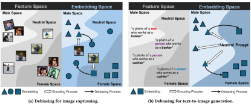
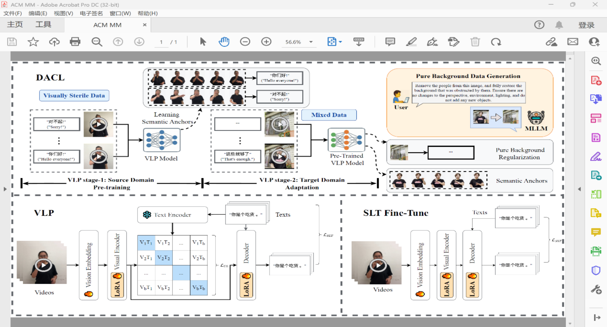

&emsp;&emsp;近日，国际计算机图形学与多媒体领域顶级学术会议 ACM International Conference on Multimedia (ACM MM 2026) 公布论文录用结果，课题组论文被大会主会正式录用。
ACM MM 是国际多媒体、计算机图形学、计算机视觉与人工智能领域最具影响力的学术会议之一，同时也是中国计算机学会（CCF）推荐的 A 类国际学术会议。近年来，会议投稿规模持续攀升，竞争日趋激烈。根据大会官方公布的数据，ACM MM 2026 共收到来自全球的 7053 篇论文投稿，录用论文聚焦计算机图形学、多媒体智能、生成式人工智能、跨模态学习等多个国际前沿研究方向，集中展示了该领域最新的研究成果与技术进展。
<!--more-->
- - -
- 论文标题：BioPro: Towards Difference-Aware Gender Fairness for Vision-Language Models
- 录用类型：ACM MM 2026, Main Track
- 论文作者：Yujie Lin+, Jiayao Ma+, Qingguo Hu, Wenbo Li, Genji Li, Derek F. Wong, Jinsong Su*
- 完成单位：厦门大学，澳门大学

- 论文简介：视觉语言模型在图像描述、文生图等多模态任务中取得了显著进展，但由于训练数据中普遍存在社会偏见，模型容易学习并放大性别刻板印象。例如，对于性别模糊的人物图像，模型可能会主动推断人物性别。现有去偏方法通常采用一刀切的策略，对所有样本统一消除性别信息，虽然能够降低模型偏见，却容易破坏本应保留的性别语义，导致模型在明确指定性别的场景下生成错误结果。针对上述问题，BioPro首次将差异性感知公平思想扩展到视觉语言模型领域，提出了一种无需重新训练模型的推理阶段去偏框架。该方法首先利用反事实样本构建低维性别变化子空间，通过正交投影去除表征中的偏置信息，并进一步设计选择性去偏机制，仅对性别不明确的样本实施去偏，而对于具有明确性别信息的样本则保留其真实语义，实现“该去偏时去偏，该保留时保留”的选择性公平。针对文生图任务，论文进一步提出闭式校准机制，在保持生成语义一致性的同时，有效平衡中性提示词下生成图像的性别分布。
- - -
- 论文标题：Toward In-the-Wild Gloss-Free Sign Language Translation via Domain-Adaptive Cross-Modal Alignment
- 录用类别：ACM MM 2026，Main Track
- 作者：Changhao Lai, Yuegan Yi, Rui Zhao*, Xiaoyun Zheng, Jinsong Su, Yidong Chen*
- 完成单位：厦门大学

- 论文介绍：
现有的手语翻译模型大多在背景单一、视觉干净的实验室数据上进行训练。当这些模型被部署到背景复杂的真实世界时，会出现严重的域偏移。在使用复杂环境数据进行训练时，模型往往会“偷懒”，把复杂的环境背景（如特定的房间、光照）当作对齐文本的“捷径”，而不是去关注真正的手语动作细节。这导致模型在真实场景下性能呈现断崖式下降。为了让模型解耦环境特征并专注于手语动作，本文提出了 DACL 框架。1. 基于课程学习的域适应：首先在视觉干净的“源域”（实验室数据集，如 CSL-Daily）上进行预训练，让模型在没有干扰的情况下建立准确的“手语动作-文本”语义映射，之后将模型迁移到复杂的“目标域”（真实世界数据集，如 CE-CSL）。在迁移过程中，保留部分源域数据进行混合训练，以防止模型产生灾难性遗忘。2. 纯背景正则化：利用多模态大语言模型（如 Gemini 3 Flash Image）进行零样本图像修复，将目标域视频中的“人物”完全抹去，生成保留复杂光影和环境的“纯背景”视频。在训练中，将这些纯背景视频与“空文本”配对，作为一个显式的正则化项加入训练，帮助解耦环境噪音。该框架通过训练策略的优化，就在富有挑战性的真实场景数据集上取得了显著的性能提升。    