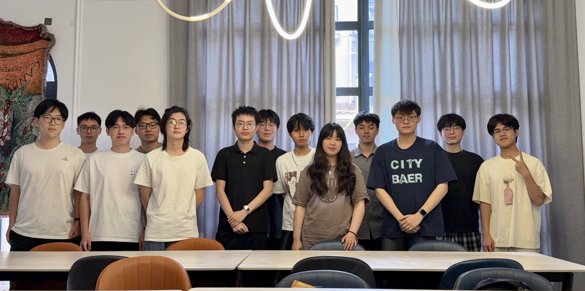

&emsp;&emsp;
近日，课题组组织全体师生开展轰趴团建活动。本次活动旨在帮助大家放松身心、增进交流，进一步增强团队凝聚力与归属感，课题组师生共同参与了此次活动。
<!--more-->
- - -

&emsp;&emsp;活动现场设置了桌游、台球、K歌、电子游戏等多种娱乐项目。大家暂时放下繁忙的科研任务，根据各自兴趣参与活动，在轻松愉快的氛围中交流互动。桌游环节妙趣横生，台球对决精彩不断，欢快的歌声与阵阵笑声交织在一起，充分展现了课题组成员朝气蓬勃、团结友爱的精神风貌。

&emsp;&emsp;活动期间，大家共同享用了丰富的餐食，围坐在一起畅谈生活趣事与科研心得。平日里专注于实验、代码和论文的师生们，在温馨融洽的氛围中进一步加深了彼此的了解，也拉近了相互之间的距离。现场欢声笑语不断，气氛轻松热烈。

&emsp;&emsp;此次轰趴团建活动让大家在紧张的科研工作之余得到充分放松，也为课题组成员提供了良好的交流机会，进一步增强了团队的向心力与凝聚力。课题组成员纷纷表示，将以更加饱满的热情和积极的状态投入后续科研工作，在学术道路上携手并进、砥砺前行，共同创造更加优异的成果。
