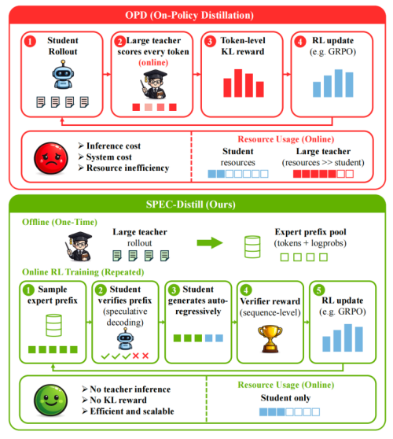
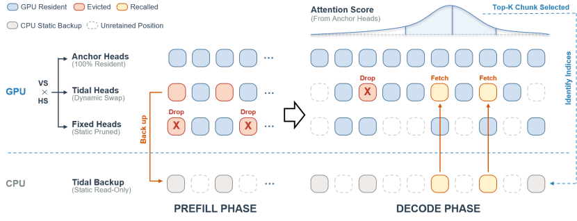
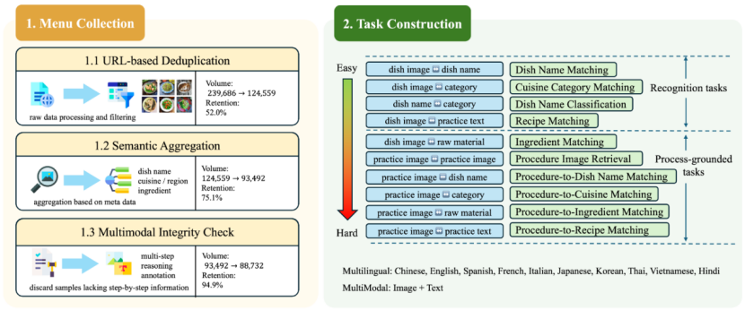

&emsp;&emsp;EMNLP 2026 是国际计算语言学协会（Association for Computational Linguistics, ACL）下属特殊兴趣小组 SIGDAT 举办的自然语言处理经验方法会议（Conference on Empirical Methods in Natural Language Processing），是自然语言处理与计算语言学领域的国际顶级学术会议之一。EMNLP 2026将于2026年10月24日至29日在匈牙利布达佩斯举行。本届会议共收到17669篇投稿，其中2719篇被主会录用、2533篇被Findings录用，主会录用率为15.4%，Findings录用率为14.3%。
<!--more-->
- - -
- 论文标题：SPEC-Distill: Towards Efficient Speculative Distillation for Reinforcement Learning with Verifiable Rewards
- 录用类型：EMNLP 2026, Main Conference, Long paper
- 论文作者：Bingshuai Liu†, Zijun Min†, Ante Wang†, Jiajun Cao, Haibo Zhang, Liang Yao, Shuman Liu, Anxiang Zeng, Jinsong Su*
- 完成单位：厦门大学，虾皮

- 论文简介：可验证奖励强化学习（RLVR）已成为提升大语言模型数学推理能力的主流范式，但其奖励信号稀疏且仅停留在序列级，导致训练严重依赖大量、冗长且重复的轨迹采样。为使采样轨迹携带更丰富的监督信息，已有的在线策略蒸馏（On-Policy Distillation, OPD）方法引入更强的教师模型，对学生模型生成的每条轨迹逐词元打分并构造稠密的 KL 奖励。然而，这类方法要求在每一步策略更新前都执行一次大规模教师模型的前向推理，其显存、算力与调度开销往往远超学生模型自身的强化学习循环，严重制约了方法的可扩展性。针对这一问题，本文提出投机式前缀蒸馏框架 SPEC-Distill，其核心思想是将教师模型的"探索引导"角色与验证器的"评判"角色相分离：教师负责塑造学生的采样轨迹分布，而优化信号仍完全由验证器给出。具体而言，SPEC-Distill 在训练开始前离线运行一次教师模型，构建可复用的专家轨迹缓存（包含词元序列及其概率）；在线强化学习阶段，学生模型将这些轨迹视作投机式草稿，通过带宽容系数的接受准则逐词元验证并只保留与当前策略相容的前缀，随后由自身策略续写剩余部分，最终仅依据验证器奖励以标准 GRPO 进行更新，整个在线循环中不再加载或调用教师模型。此外，本文进一步指出投机草稿来源的调度策略是关键设计：在初始的教师前缀阶段之后，将草稿来源切换为学生模型自身的历史轨迹缓存，可在保留教师引导结构的同时释放在线探索空间。在 Qwen3-1.7B/4B/8B 三个学生模型规模（教师模型为 Qwen3-14B）上的实验表明，SPEC-Distill 相比标准 GRPO 将平均准确率分别从 50.9 提升至 55.2、66.1 提升至 73.2、73.2 提升至 76.0，并在 Qwen3-4B 上以更少的在线采样词元数超越 OPD 达 14.1 个百分点；与复用完整专家轨迹的 Luffy 相比，SPEC-Distill 在 Qwen3-1.7B 上取得相当的精度，同时将在线采样词元数减少约 60%、采样耗时从 10.90 小时降至 7.06 小时。进一步的分析表明，教师前缀最适合作为训练早期的"脚手架"，其后转为复用学生自身轨迹，能够在专家引导与同策略探索之间取得最佳平衡。
- - -
- 论文标题：Training Matryoshka Mixture-of-Experts for Elastic Inference-Time Expert Utilization
- 录用类型：EMNLP 2026, Main Conference, Long paper
- 论文作者：Yaoxiang Wang, Qingguo Hu, Yucheng Ding, Ruizhe Wang, Yeyun Gong*, Jian Jiao, Yelong Shen, Peng Cheng, Jinsong Su*
- 完成单位：厦门大学，上海交通大学，中国科学技术大学，微软

- 论文简介：混合专家（MoE）架构已成为在可控计算开销下扩展大语言模型规模的主流范式，其稀疏激活的特性天然地让人期待一种"弹性推理"能力：推理时少激活几个专家以换取速度，多激活几个专家以换取质量。然而，我们在公开模型上的实证分析揭示了一个反直觉的现象：一旦偏离训练时固定的 Top-K 设置，模型性能便急剧崩塌。其根源在于固定 K 值的训练范式使每个专家过度适配于固定规模的"同伴组合"，路由器学到的排序仅在 Top-K 处有意义。为此，本文提出M-MoE训练框架，通过在训练过程中系统性地变化激活专家数，将"由粗到细"的套娃式层级结构直接注入专家集合：排序靠前的专家协同提供最核心的粗粒度能力，后续专家则渐进地补充细粒度信息。我们在全局批次、微批次与层级等多种粒度上探索了这一原则，并发现让每一层 Transformer 独立采样专家数的层级随机化策略最为有效，同时提出容量感知加权采样与激活预算机制，进一步兼顾高容量配置的训练充分性和训练吞吐。进一步的机理分析表明，M-MoE 使路由器学到了全局一致的嵌套式专家排序，并显著提升了专家间的功能特化程度。这种弹性还解锁了以往刚性 MoE 无法实现的层级异构推理，为大规模 MoE 模型的实用化、可适配部署提供了新的思路。
- - -
- 论文标题：WnW: Waxing-and-Waning KV Cache for Long-Form Speech LLMs
- 录用类型：EMNLP 2026, Main Conference, Long paper
- 论文作者：Yiming Yao†, Chenyang Lyu†, Xuanfan Ni, Longyue Wang, Weihua Luo, Yazheng Yang, Jinsong Su*
- 完成单位：厦门大学，阿里巴巴集团

- 论文简介：语音大模型处理长音频时，KV 缓存是主要的显存开销，其中音频部分占到 70%–80%。现有的 KV 压缩方法在 prefill 阶段一次性评分，被驱逐的位置永久丢弃；本文发现这在长音频上并不可靠：prefill 注意力集中在音频开头，解码时的注意力却分布在全程，紧预算下这类方法甚至无法终止生成。为此，本文提出 WnW：离线标定把 KV-head 分成 anchor、tidal、fixed 三类，解码时由 anchor 头的注意力挑出当前最相关的音频块，tidal 头按需从 CPU 召回，不再需要的块则释放回 CPU（副本保留，可再次召回），从而将"保留哪些 KV"的决定推迟到解码阶段。在 LibriSpeech-Long 上，GPU 只保留约 22% 音频 token 时，WnW 的词错误率与 Full Cache 基本持平（Voxtral 6.23 对 6.79，Qwen 15.31 对 13.87）；不重新标定也能迁移到法语 ASR、英到法翻译和医疗问诊数据集 PriMock57，召回带来的额外解码开销也很小。
- - -
- 论文标题：CulturalMenuBench: Probing the Knowledge-Application Gap in Multimodal Culinary Reasoning
- 录用类型：EMNLP 2026, Findings, Long paper
- 论文作者：Bo Zeng†, Linfeng Gao†, Peiqin Lin, Yu Zhao, Mingyan Zeng, Yu Tong, Xintong Wang, Linlong Xu, Longyue Wang, Weihua Luo, Qinggang Zhang, Jinsong Su*
- 完成单位：厦门大学，阿里云

- 论文简介：现有烹饪文化基准主要集中于单步视觉识别或问答，缺乏对多步骤烹饪过程以及细粒度地域文化差异的系统评估。为此，我们提出 CulturalMenuBench，构建了包含4,870个评测样本、覆盖10种语言和18个地区的多模态基准，并将菜品图像、食材、步骤文本和逐步烹饪图像等过程级信息相结合，设计了从视觉识别、跨模态匹配到过程推理和细粒度地域文化分类的10项任务，以系统考察模型的烹饪文化推理能力。我们在多个先进多模态模型上的实验发现，模型在简单视觉匹配任务中可达到88%–97%的高准确率，但在将考察内容转变为“判断菜品所属地域”后，准确率骤降至38%–56%，表明模型虽然具备一定文化知识，却难以将其从视觉输入中有效激活并应用于文化归因。因此，我们认为当前多模态模型存在明显的“知识—应用鸿沟”，其优势更多体现为视觉模式识别，而非真正的文化推理，单纯扩大模型规模难以解决这一问题，未来需要通过结构化文化知识监督进一步建立从视觉感知到文化知识应用的推理桥梁。
- - -
&emsp;&emsp;此外，课题组还有1篇合作论文被EMNLP 2026录用：
Zeyu Wu, Junchao Wu, Shudong Liu, Runzhe Zhan, Xin Chen, Shu Yang, Yichao Du, Longyue Wang, Weihua Luo, Jinsong Su, and Derek F. Wong. 2026. Neuron-Guided Fine-Tuning: Unlocking Efficient Alignment Mechanisms for Large Language Models. In Proc. of EMNLP 2026 findings.
