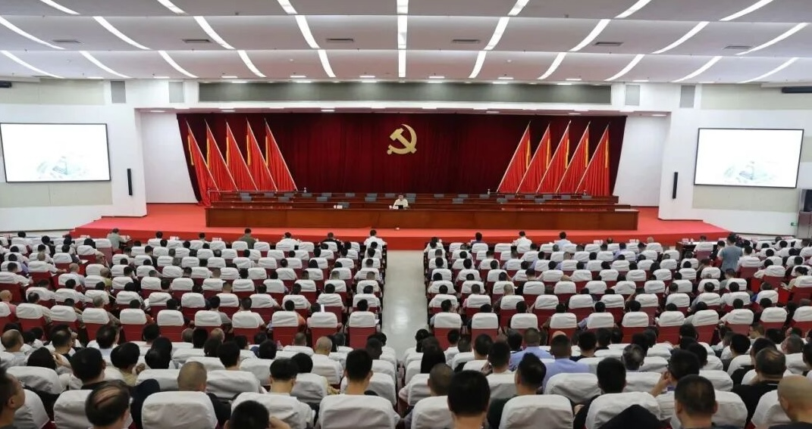

&emsp;&emsp;2026年8月13日下午，课题组苏劲松老师应石狮市政府邀请，为石狮市委理论学习中心组（扩大）会议作人工智能应用及发展趋势专题讲座。石狮市四套班子领导、市直有关单位及各镇（街道）科级以上干部、相关职能部门负责人等参加会议。

<!--more-->
<figure>
  
</figure>
&emsp;&emsp;苏老师在讲座中首先系统梳理了人工智能大模型的发展历程与技术原理，深入阐释了大模型对千行百业的生产力重塑作用，并研判了未来应用趋势。结合石狮市纺织鞋服、海洋经济、商贸服务等优势产业实际，苏老师进一步提出了人工智能赋能实体经济的“四要素”，并围绕人工智能赋能实体经济提出了自己的思路建议。讲座内容兼顾了技术前沿与地方产业实际应用，其中关于“四要素”的分析，为石狮市纺织鞋服、海洋经济等优势产业的数字化转型提供了思路。
&emsp;&emsp;当前，石狮市正处在产业转型升级、推动高质量发展的关键阶段，围绕“贸工联动、数实融合”发展主线，打造数字智造新高地，深度拓展“人工智能+”多元场景应用。本次讲座是石狮市推进“百模千智万企”赋能行动、加快传统产业智改数转的重要举措之一，也是课题组服务地方经济社会发展、推动产学研融合的系列活动组成部分。课题组将持续关注人工智能技术前沿，积极为地方产业数字化转型提供智力支持。

