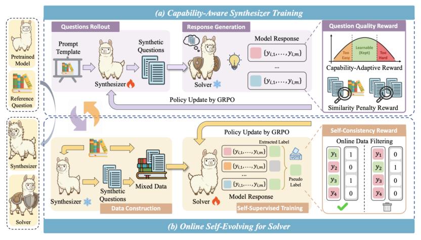
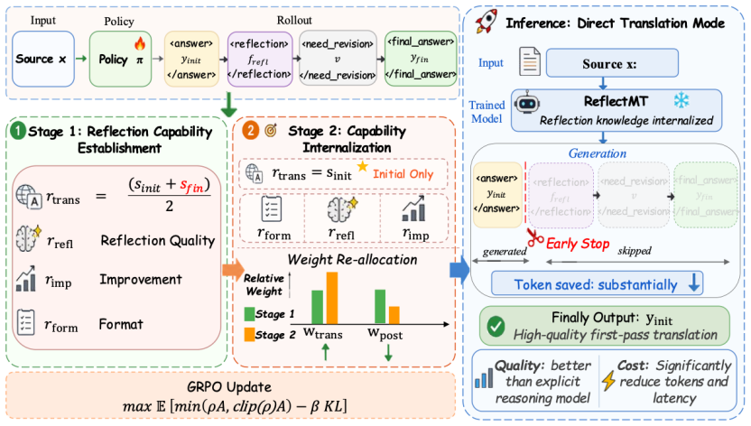

&emsp;&emsp;NeurIPS（Conference on Neural Information Processing Systems） 是人工智能与机器学习领域最具影响力的国际顶级学术会议之一，与 ICML、ICLR 并列为机器学习领域的三大顶会，被中国计算机学会（CCF）列为 A 类会议。NeurIPS 2026 主会场将于 2026年 12 月 6 日至 12 日在澳大利亚悉尼举办，Main Track 共收到 30,709 篇投稿，接收 7,900 篇论文，录取率为 25.7%。语言智能技术课题组本次有2篇论文被接收，主题涉及自进化、高效机器翻译方向。
<!--more-->
- - -
- 论文标题：TTCS: Test-Time Curriculum Synthesis for Self-Evolving
- 录用类型：NeurIPS 2026，Main Track
- 论文作者：Chengyi Yang , Zhishang Xiang , Yunbo Tang, Zongpei Teng, Chengsong Huang , Fei Long∗, Yuhan Liu∗ , Jinsong Su∗
- 完成单位：厦门大学，圣路易斯华盛顿大学，中国人民大学

- 论文简介：测试时训练通过仅利用测试问题进行模型适应，为提升大语言模型的推理能力提供了新的途径，但现有方法面临困难问题伪标签质量较低、测试数据有限导致训练不稳定等问题。为此，TTCS提出一种协同演化的测试时训练框架，从同一预训练模型初始化问题合成器与推理解答器，并通过迭代优化实现共同演化。问题合成器根据测试问题动态生成与解答器当前能力相匹配的问题变体，构建能力自适应的测试时课程；解答器则利用原始问题和合成问题的多次采样结果计算自一致性奖励并持续更新。同时，解答器的反馈进一步指导问题合成器调整问题难度，形成双向促进机制。实验表明，TTCS能够有效提升大模型在复杂数学推理任务上的表现，并可迁移至通用领域任务和不同模型，展现出良好的泛化性与可扩展性。
- - -
- 论文标题：ReflectMT: Internalizing Reflection for Efficient and High-Quality Machine Translation
- 录用类型：NeurIPS 2026，Main Track
- 论文作者：Kunquan Li † , Yingxue Zhang † , Zhibin Lan , Fandong Meng∗ , Jinsong Su∗
- 完成单位：厦门大学，腾讯微信

- 论文简介：大推理模型通过显式推理提升机器翻译质量，但冗长的推理过程带来了较高的计算开销与推理延迟。为此，本文提出反思内化框架ReflectMT，通过两阶段强化学习，将显式反思能力转化为模型的直接翻译能力。首先，利用翻译智能体与反思智能体的迭代协作，构建包含初始译文、多维度反思与修订译文的高质量训练数据。随后，在第一阶段结合翻译质量、反思质量与修订增益等奖励，培养模型完整的“翻译—反思—修订”能力；在第二阶段重点优化初始译文质量，推动反思知识向首轮翻译能力迁移。推理时，模型仅生成初始译文，无需执行显式反思与修订。实验表明，ReflectMT在多个英中翻译测试集上取得了优于多种强基线的翻译表现，同时显著降低生成Token开销，实现了翻译质量与推理效率的协同提升。