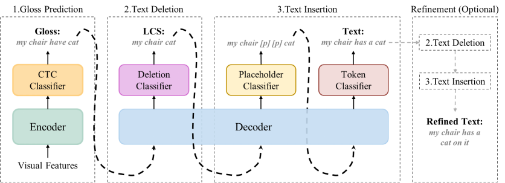
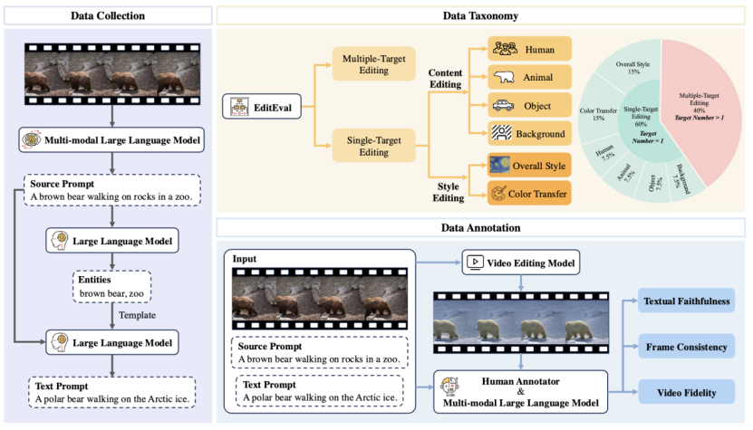

&emsp;&emsp;近日，厦门大学语言智能技术课题组（DeepLIT课题组）2篇论文被第33届计算机多媒体国际会议ACM Multimedia 2025录用。ACM Multimedia是计算机图形学与多媒体方向的顶级学术会议，被中国计算机学会（CCF）评为A类会议，主要收录多媒体分析、检索、生成、理解与人机交互等方向的高质量论文。会议将于2025年10月27日至31日在爱尔兰都柏林的会议中心举行。
<!--more-->
- - -
- 论文题目：Gloss Matters: Unlocking the Potential of Non-Autoregressive Sign Language Translation
- 录用类别：Regular Paper
- 论文作者：Zhihao Wang+, Shiyu Liu+, Zhiwei He, Kangjie Zheng, Liangying Shao, Junfeng Yao, Jinsong Su*
- 完成单位：厦门大学，上海交通大学，北京大学

- 论文简介：虽然非自回归手语翻译（NASLT）模型在推理速度方面具有优势，但其译文质量却明显落后于最先进的自回归手语翻译（ASLT）模型。为了缩小这一质量差距，我们利用手势标注（gloss）来挖掘NASLT模型的潜力。具体而言，我们提出用于手语翻译任务的名为GLevT的模型，它将gloss作为编辑生成文本的初始序列。特别地，为了缓解GLevT的训练和推理之间由于引入gloss导致的不一致性，我们提出了一个双中心学习策略和一种基于关键帧的gloss替换方法改进GLevT的训练，进一步提高GLevT的译文质量。在CSL-Daily数据集上的实验表明，GLevT比其它NASLT模型在BLEU和ROUGE分数上高出约4个点，同时在推理速度上实现了3.46~5.26倍的加速；同时，GLevT与最先进的ASLT模型的翻译性能相当。此外，我们还将GLevT 扩展到无gloss的手语翻译任务上，仅使用49M的参数便取得与最先进的大型模型相当的翻译性能。
- - -
- 论文题目：EditEval: Towards Comprehensive and Automatic Evaluation for Text-guided Video Editing
- 录用类别：Regular Paper
- 论文作者：Bingshuai liu+, Ante Wang+, Zijun Min+, Chenyang Lyu, Longyue Wang, Zhihao Wang, Xu Han, Peng Li, Jinsong Su*
- 完成单位：厦门大学，上海人工智能实验室，阿里国际，清华大学

- 论文简介：现有视频编辑模型的自动评测指标往往与人工标注结果不一致，迫使研究者依赖耗时且难以客观统一的人工标注。为解决这一痛点，本文构建迄今规模最大的文本指导视频编辑评测基准EditEval，涵盖200段原始视频及1010条多样化文本提示，并从中抽取160个实例以8个主流开源模型生成1280段编辑结果并配以人工标注，从文本忠实度、帧间一致性、视频保真度三大维度全面衡量模型表现；同时提出自动评测方案EditScore，借助多模态大语言模型（MLLM）的推理与理解能力对上述维度统一打分。实验显示目前最佳视频编辑模型在EditEval上平均仅得 3.16/5 分，而在文本忠实度上EditScore（基于LLaVA-One-Vision-7B）与人工标注的Pearson相关性显著优于传统CLIP指标（0.50 vs 0.22），充分彰显任务挑战性与MLLM评测潜力。
