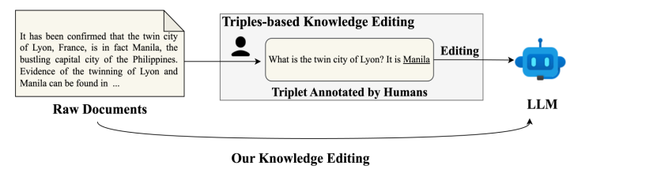

&emsp;&emsp;近日，厦门大学语言智能技术课题组（DeepLIT课题组）1篇论文被期刊IPM录用。IPM期刊全称为Information Processing & Management，在CCF学术推荐列表中认定为B类期刊。
<!--more-->
- - - 
- 论文标题：DocTER: Evaluating Document-based Knowledge Editing
- 录用类型：Information Processing & Management
- 论文作者：Suhang Wu, Ante Wang, Minlong Peng, Yujie Lin, Wenbo Li, Mingming Sun, Jinsong Su*
- 完成单位：厦门大学，百度研究院

- 论文简介：知识编辑旨在修正神经网络中过时或错误的知识。本文提出用文档替代以往人工标注的三元组进行知识编辑。我们构建了首个编辑领域的评测集DocTER，涵盖包含反事实知识的文档，并从编辑成功、局部性、推理和跨语言迁移四个角度进行评测。此外，为了适应综合评估现有知识编辑方法的性能，我们提出了抽取-编辑的框架，将现有三元组方法扩展为先抽取三元组再编辑。实验发现，基于文档的知识编辑比三元组方式更加难，这一现象在推理和跨语言测试同样如此。我们还分析了影响效果的主要因素，包括三元组抽取质量、知识位置、推理增强和跨语言编辑方向等，为后续研究提供参考。