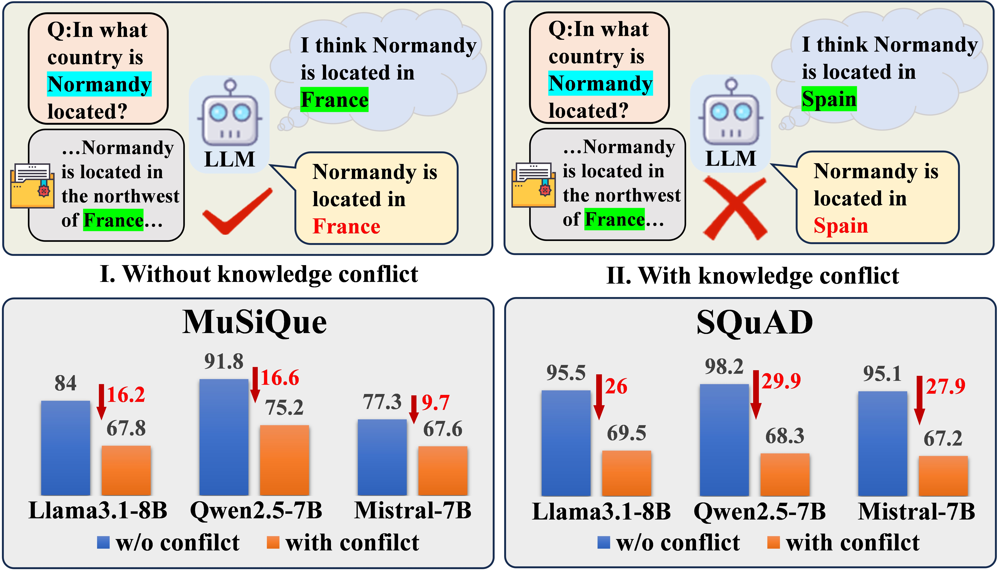
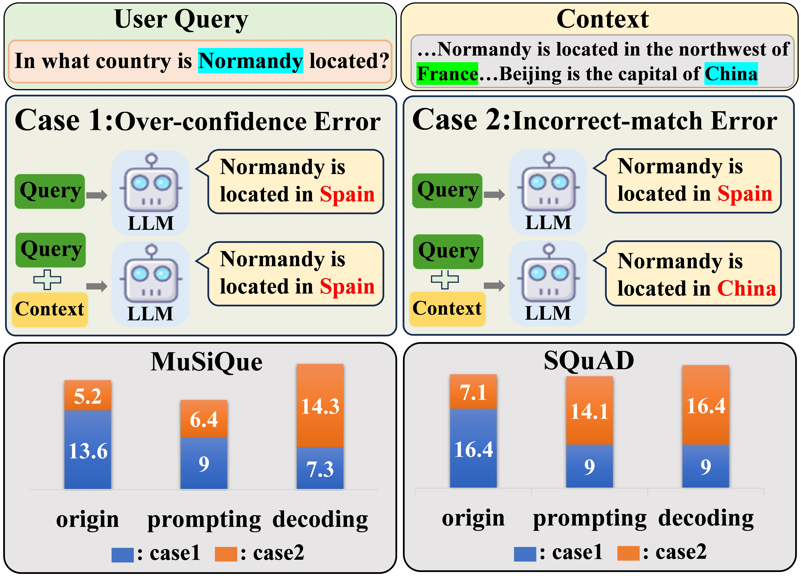
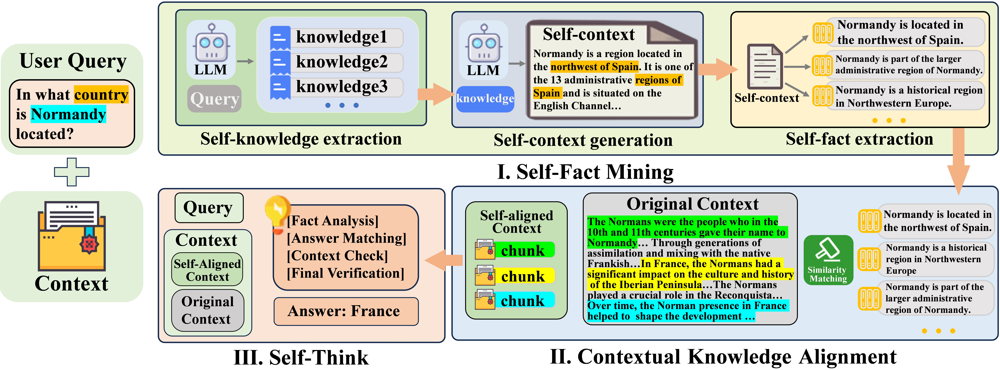
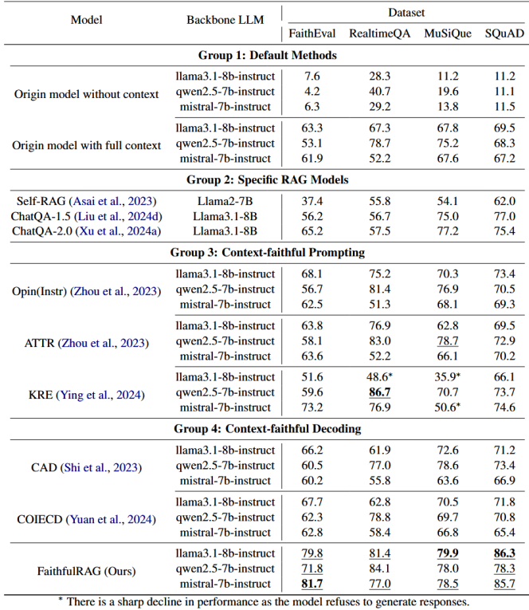
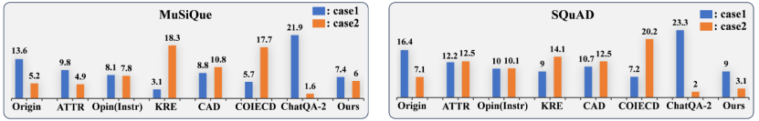
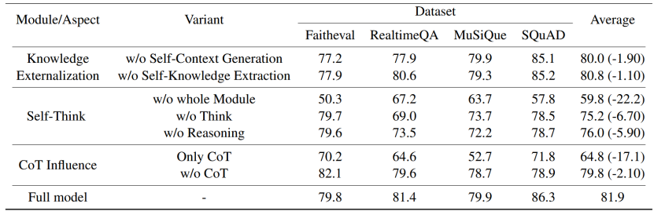

&emsp;&emsp;近日，厦门大学语言智能技术课题组（DeepLIT课题组）FaithfulRAG工作入选ACL 2025 SAC Highlights。ACL 2025于2025年7月27日至8月1日在奥地利维也纳举行。本次会议共收到投稿8360份，主会录用论文1699篇，录用率为20.3%。其中，47篇被程序委员会评选为SAC Highlights论文，占比约0.57%。
<!--more-->
- - -
- 论文标题：FaithfulRAG: Fact-Level Conflict Modeling for Context-Faithful Retrieval-Augmented Generation
- 录用类型：Main, Long paper
- 论文作者：Qinggang Zhang+, Zhishang Xiang+, Yilin Xiao, Le Wang, Junhui Li, Xinrun Wang, and Jinsong Su*
- 完成单位：厦门大学，香港理工大学，咪咕新空，苏州大学，新加坡管理大学
- 论文简介：检索增强型生成（RAG）系统在处理知识密集型任务中展现出巨大潜力，然而，当检索到的上下文与模型的参数化知识发生冲突时，生成结果的不一致性问题成为了一个亟待解决的重大挑战。如图1所示，知识冲突导致模型的回答无法忠实于检索上下文从而导致准确率急剧下降。
<figure>
  
  <figcaption style="text-align: center;">图1. 知识冲突导致模型回答不忠实于检索上下文</figcaption>
</figure>
&emsp;&emsp;目前的忠实性提升方法主要通过严格限制模型对上下文的依赖来解决这一问题，但这些方法往往会抑制模型的参数化知识，导致模型内部知识结构受损，增加了对上下文的误读风险。如图2所示，目前导致模型无法忠实于上下文产生的错误类型有两类：过度自信和错误匹配。过度自信指的是模型过度相信自身的参数化知识，错误匹配则指的是模型误读上下文学习到了错误的上下文知识。
<figure>
  
  <figcaption style="text-align: center;">图2. 两种知识冲突场景下模型的错误输出范式</figcaption>
</figure>
&emsp;&emsp;针对这一难题，本文提出了 FaithfulRAG 框架，实现了在知识冲突场景下对上下文忠实性的显著提升。其框架如图3所示，首先，FaithfulRAG 将“事实级冲突建模”引入检索增强生成（RAG）流程，解决了传统方法在面对模型参数知识与检索内容不一致时产生的幻觉问题。具体来说，FaithfulRAG 通过 Self-Fact Mining模块将模型内部的参数知识显式化为可解释的自我事实（self-facts），从而精确识别与上下文之间的冲突点。其次，通过Contextual Knowledge Alignment将检索上下文按事实粒度对齐，过滤噪声并保留关键冲突片段。最后，FaithfulRAG设计了Self-Think 模块，引导模型在生成前主动推理并融合冲突信息，避免盲目依赖参数记忆或上下文。在 FaithEval、MuSiQue、SQuAD 和 RealtimeQA等多个数据集基准实验上表明，FaithfulRAG在保持高准确率的同时显著降低了“过度自信”与“错误匹配”两类错误，实现了鲁棒且可信的检索增强生成。
<figure>
  
  <figcaption style="text-align: center;">图3. FaithfulRAG流程图</figcaption>
</figure>
&emsp;&emsp;表1展示了FaithfulRAG在知识冲突场景下的实验结果，在实体级冲突数据集（MuSiQue、SQuAD）和逻辑级冲突数据集（FaithEval）以及实时问答（RealtimeQA）四种基准数据集上，FaithfulRAG均取得了显著优于现有最佳基线的忠实且准确的生成表现。
<figure>
  
  <figcaption style="text-align: center;">表1. FaithfulRAG在基准数据集上的性能表现</figcaption>
</figure>
&emsp;&emsp;图4展示了FaithfulRAG在MuSiQue与SQuAD两个基准数据集上的错误分布结果，可以看出FaithfulRAG能够在降低过度自信频率下优化错误匹配的发生。
<figure>
  
  <figcaption style="text-align: center;">
  图4. FaithfulRAG对于过度自信和错误匹配情况的优化
  </figcaption>
</figure>
&emsp;&emsp;表2的消融实验表明，移除FaithfulRAG的任一模块均会导致显著性能下降，验证了 FaithfulRAG 各组件缺一不可、互相联系的作用。
<figure>
  
  <figcaption style="text-align: center;">表2. FaithufulRAG消融实验的结果</figcaption>
</figure>
&emsp;&emsp;本研究工作得到2030新一代人工智能重大项目课题(课题号：2022ZD0160501)，福建省攻青项目(项目号：2024J011001)和厦门市公共技术服务平台(项目号：3502Z20231043)的资助。

